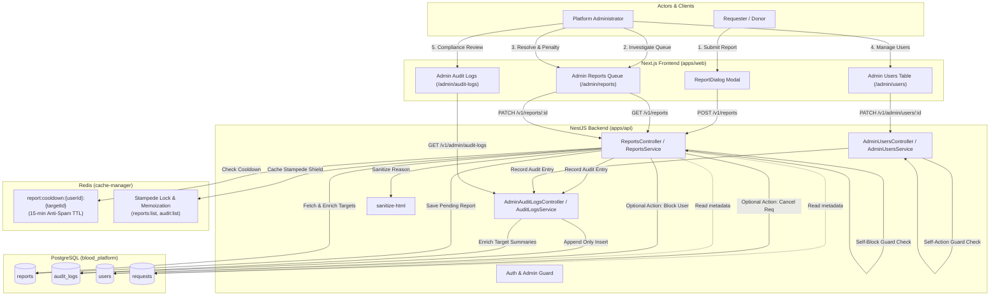
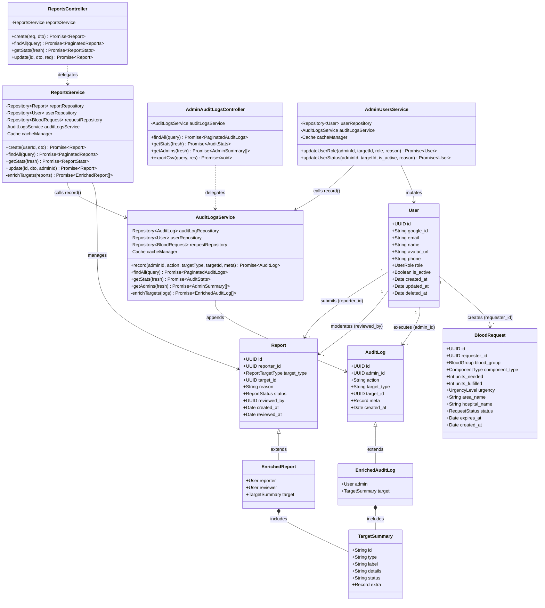
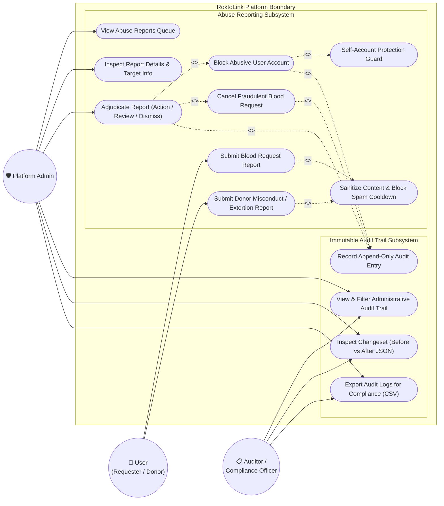
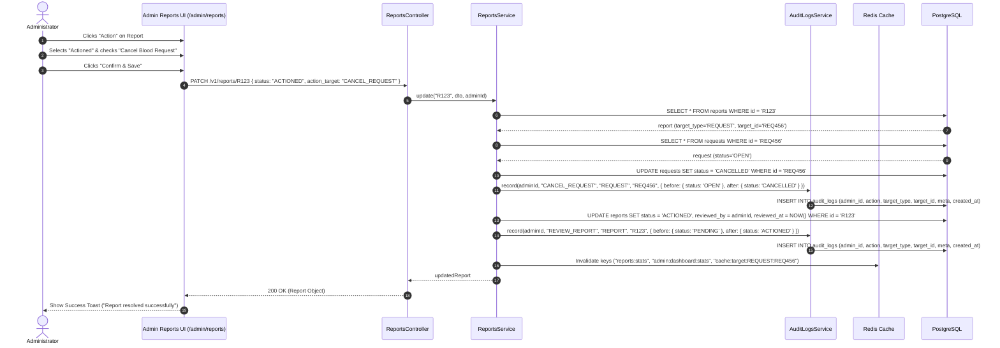
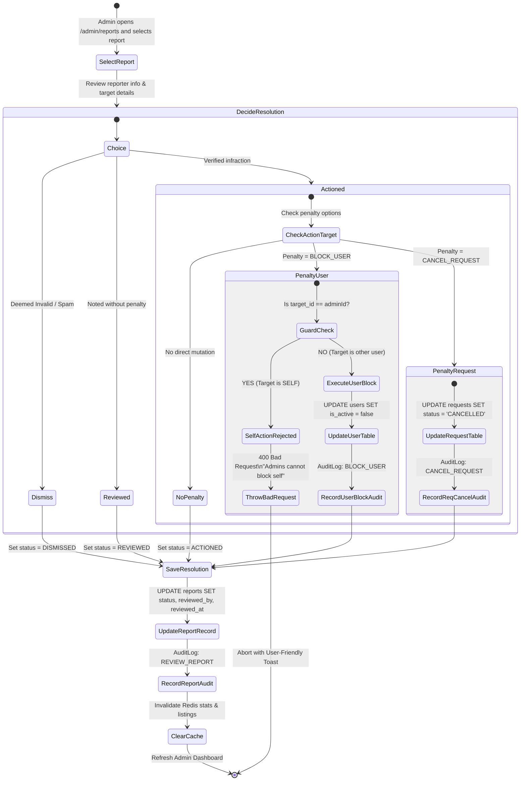
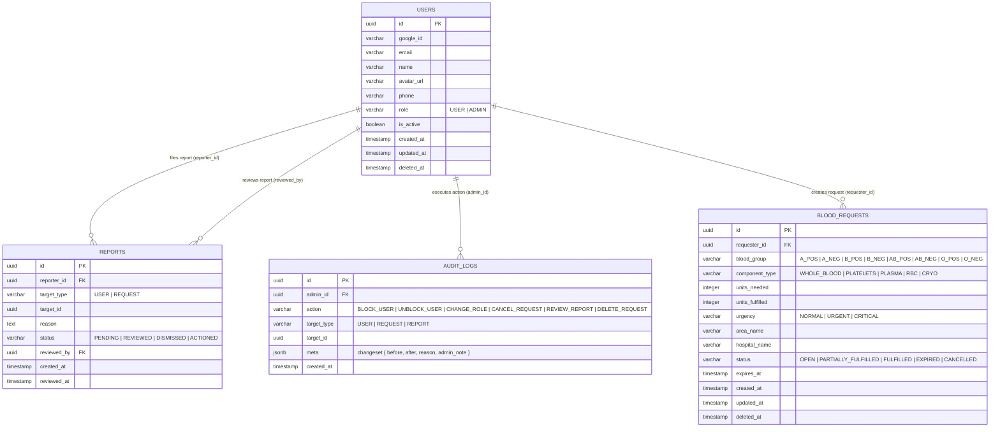

# Audit Logs & Abuse Reports System Guide

A comprehensive architectural, structural, and operational guide to the **Abuse Reporting & Moderation Queue** and the **Immutable Audit Logging System** in the RoktoLink Blood Donation Platform.

---

## Table of Contents
1. [High-Level Architecture & Flow](#1-high-level-architecture--flow)
2. [UML Diagrams Suite](#2-uml-diagrams-suite)
   - [2.1 UML Class Diagram (Structural Model)](#21-uml-class-diagram-structural-model)
   - [2.2 UML Use Case Diagram (Functional Model)](#22-uml-use-case-diagram-functional-model)
   - [2.3 UML Sequence Diagram (Adjudication & Auditing Flow)](#23-uml-sequence-diagram-adjudication--auditing-flow)
   - [2.4 UML Activity Diagram (Moderation & Self-Defense Pipeline)](#24-uml-activity-diagram-moderation--self-defense-pipeline)
   - [2.5 UML Entity Relationship Diagram (Data Model)](#25-uml-entity-relationship-diagram-data-model)
3. [Abuse Reporting & Moderation Subsystem](#3-abuse-reporting--moderation-subsystem)
   - [3.1 Reporting Entrypoints in UI](#31-reporting-entrypoints-in-ui)
   - [3.2 Input Sanitization & Anti-Spam Cooldown](#32-input-sanitization--anti-spam-cooldown)
   - [3.3 Admin Moderation Queue & Resolution Workflow](#33-admin-moderation-queue--resolution-workflow)
   - [3.4 Self-Account Protection Mechanism](#34-self-account-protection-mechanism)
   - [3.5 Polymorphic Target Enrichment](#35-polymorphic-target-enrichment)
4. [Immutable Audit Logging Subsystem](#4-immutable-audit-logging-subsystem)
   - [4.1 Append-Only Compliance Architecture](#41-append-only-compliance-architecture)
   - [4.2 Logged Administrative Operations](#42-logged-administrative-operations)
   - [4.3 Changeset Structure (Before vs After)](#43-changeset-structure-before-vs-after)
   - [4.4 Audit Viewer & Compliance Export](#44-audit-viewer--compliance-export)
5. [Human-Readable Formatting Layer](#5-human-readable-formatting-layer)
6. [Security & Safeguards Matrix](#6-security--safeguards-matrix)
7. [Verification & Developer Guide](#7-verification--developer-guide)

---

## 1. High-Level Architecture & Flow



---

## 2. UML Diagrams Suite

### 2.1 UML Class Diagram (Structural Model)

This diagram captures the internal structural model across entities, services, controllers, DTOs, and shared types.



---

### 2.2 UML Use Case Diagram (Functional Model)



---

### 2.3 UML Sequence Diagram (Adjudication & Auditing Flow)

The following sequence illustrates an administrator resolving a fraudulent blood request report, issuing a cancellation, and creating an immutable audit entry:



---

### 2.4 UML Activity Diagram (Moderation & Self-Defense Pipeline)



---

### 2.5 UML Entity Relationship Diagram (Data Model)



---

## 3. Abuse Reporting & Moderation Subsystem

### 3.1 Reporting Entrypoints in UI

| Entrypoint | Component | Infraction Focus | Target Type |
| :--- | :--- | :--- | :--- |
| **Request Header** | `RequestDetailHeader.tsx` | Fake emergency, commercial blood seller, scam hospital | `REQUEST` |
| **Donor Card** | `RequesterResponseItem.tsx` | Donor demanding payment, extortion, harassment, no-show | `USER` |
| **Donor Modal** | `DonorProfileModal.tsx` | False identity, fraudulent credentials, misbehavior | `USER` |

#### Preset Options in `ReportDialog`:
- 💰 **Demanding money or payment for blood donation (strictly prohibited)**
- ⚠️ **Fake or fraudulent blood request**
- 🚫 **Harassment, hate speech, or inappropriate behavior**
- ❌ **No-show after committing without notice**
- 🎭 **Impersonation or deceptive identity**
- 📝 **Other misconduct**

---

### 3.2 Input Sanitization & Anti-Spam Cooldown

1. **Anti-XSS**: All user-submitted reasons pass through `sanitize-html` before reaching the database, stripping script tags and malicious payloads.
2. **Duplicate Cooldown**: ReportsService maintains a Redis key:
   ```text
   report:cooldown:{userId}:{targetId}  (TTL: 900 seconds = 15 minutes)
   ```
   Submitting duplicate reports within 15 minutes returns `400 Bad Request` with:
   *"You have already submitted a report for this item recently. Our admin team is reviewing it."*

---

### 3.3 Admin Moderation Queue & Resolution Workflow

The Moderation Queue at `/admin/reports` features:
- **Summary Metrics**: Pending count, actioned count, dismissed count, and total reports.
- **Filter Toolbar**: Filter by status (`PENDING`, `REVIEWED`, `ACTIONED`, `DISMISSED`), target type (`USER`, `REQUEST`), or search by reason/reporter name.
- **Detailed Inspection**: Shows the reporter’s identity, target details, and unedited reason text.
- **Resolution Decisions**:
  - `ACTIONED`: Confirms abuse; enables one-click penalties (`BLOCK_USER` or `CANCEL_REQUEST`).
  - `REVIEWED`: Infraction investigated and closed without active penalty.
  - `DISMISSED`: Flagged report deemed invalid, spam, or a false alarm.

---

### 3.4 Self-Account Protection Mechanism

To prevent administrative lockout or rogue behavior:
1. **Backend Guard**: Both `AdminUsersService` and `ReportsService` verify:
   ```ts
   if (targetId === adminId && !is_active) {
     throw new BadRequestException("Administrators cannot block their own account.");
   }
   if (targetId === adminId && role !== UserRole.ADMIN) {
     throw new BadRequestException("Administrators cannot remove their own administrator privileges.");
   }
   ```
2. **Frontend Safeguard**: The Admin UI detects if `report.target_id === currentAdmin.id`. It hides the block checkbox, displays a yellow `Self-Account Protected` alert, and disables the action trigger.

---

### 3.5 Polymorphic Target Enrichment

Because `reports` and `audit_logs` store polymorphic target references (`target_type` + `target_id`), the services batch-load target entities and construct a unified `TargetSummary`:
- **Blood Request Targets**: Automatically resolves blood group and unit count into clean human-readable text (`O+ (1 unit) at Dhaka Medical`).
- **User Targets**: Resolves user name, email, phone, and current status (`ACTIVE` vs `BLOCKED`).

---

## 4. Immutable Audit Logging Subsystem

### 4.1 Append-Only Compliance Architecture
- Audit records can **only be created**.
- The API intentionally exposes **no PATCH, PUT, or DELETE** endpoints for `/admin/audit-logs`.
- All administrative operations record before/after state snapshots in PostgreSQL `jsonb` columns.

---

### 4.2 Logged Administrative Operations

| Action | Source Module | Trigger | Metadata Captured |
| :--- | :--- | :--- | :--- |
| `BLOCK_USER` | `AdminUsersService` / `ReportsService` | Admin blocks abusive user | `{ reason, before: { is_active: true }, after: { is_active: false } }` |
| `UNBLOCK_USER` | `AdminUsersService` | Admin restores user access | `{ reason, before: { is_active: false }, after: { is_active: true } }` |
| `CHANGE_ROLE` | `AdminUsersService` | Admin promotes/demotes role | `{ reason, before: { role }, after: { role } }` |
| `CANCEL_REQUEST` | `ReportsService` | Admin cancels fraudulent request | `{ reason, before: { status }, after: { status: "CANCELLED" } }` |
| `DELETE_REQUEST` | `AdminRequestsService` | Admin deletes inappropriate post | `{ reason, deleted_at }` |
| `REVIEW_REPORT` | `ReportsService` | Admin adjudicates abuse report | `{ before: { status }, after: { status }, admin_note, action_target }` |

---

### 4.3 Changeset Structure (Before vs After)

```json
{
  "reason": "Blocked via Report #f92969c2: Demanding money from requester",
  "before": {
    "is_active": true
  },
  "after": {
    "is_active": false
  },
  "admin_note": "Confirmed demanding 5,000 BDT before donating blood."
}
```

---

### 4.4 Audit Viewer & Compliance Export

The Audit Log page (`/admin/audit-logs`) provides:
1. **Multi-Column Filtering**:
   - Filter by specific admin.
   - Filter by action code.
   - Filter by target type (`USER`, `REQUEST`, `REPORT`).
   - Filter by date range (`From` and `To`).
2. **Interactive Changeset Inspector**:
   - Visual side-by-side diff of `before` and `after` values.
   - Raw JSON toggle for engineering and forensics.
3. **CSV Export**:
   - Endpoint: `GET /v1/admin/audit-logs/export`
   - Exports the currently filtered audit logs directly to a downloadable CSV file.

---

## 5. Human-Readable Formatting Layer

Internal database columns use machine-friendly enums (`O_POS`, `WHOLE_BLOOD`, `CRITICAL`). Formatting occurs at both the API enrichment layer and frontend presentation layer:

```mermaid
graph LR
    DB[(PostgreSQL)] -->|"req.blood_group = 'O_POS'"| BE[ReportsService / AuditLogsService]
    BE -->|"formatBloodGroup('O_POS')\n=> 'O+'"| APIOut[Enriched JSON API Response]
    APIOut -->|"label: 'O+ (1 unit) at saads'"| FE[Next.js Admin Client]
    FE -->|"toHumanReadable(target?.label)"| UI[Browser Render: 'O+ (1 unit) at saads']
```

### Key Functions (`@repo/shared` & `@/lib/labels`):
- **`formatBloodGroup(bg)`**: Case-insensitively converts `O_POS`, `o_pos`, `a_neg`, `AB_POS` into `O+`, `A-`, `AB+`.
- **`toHumanReadable(str)`**:
  - Replaces embedded enum strings (`O_POS (1 units)` $\rightarrow$ `O+ (1 unit)`).
  - Normalizes unit count grammar (`1 units` $\rightarrow$ `1 unit`, `2 units` $\rightarrow$ `2 units`).
  - Converts system constants (`WHOLE_BLOOD` $\rightarrow$ `Whole Blood`, `CRITICAL` $\rightarrow$ `Critical`, `URGENT` $\rightarrow$ `Urgent`).

---

## 6. Security & Safeguards Matrix

| Threat / Scenario | Defense Mechanism | Implementation File |
| :--- | :--- | :--- |
| **Self-Deactivation** | Admin cannot deactivate own account | `apps/api/src/modules/admin/admin-users.service.ts` |
| **Self-Demotion** | Admin cannot remove own ADMIN role | `apps/api/src/modules/admin/admin-users.service.ts` |
| **Self-Block via Report** | Moderation action rejects self-block | `apps/api/src/modules/reports/reports.service.ts` |
| **Report Spam Flooding** | 15-minute Redis cooldown | `apps/api/src/modules/reports/reports.service.ts` |
| **Stored XSS in Reports** | `sanitize-html` payload stripping | `apps/api/src/modules/reports/reports.service.ts` |
| **Raw JSON Toast Errors** | `ApiError.extractMessage` cleanly unwraps nested errors | `apps/web/src/lib/api/client.ts` |
| **Cache Stampede / Dog-piling** | `getOrSetWithStampedeProtection` memoizes simultaneous DB queries | `apps/api/src/common/utils/cache.util.ts` |

---

## 7. Verification & Developer Guide

### 7.1 Running Automated Unit Tests
```bash
pnpm --filter api test
```
*Executes all 4 unit test suites (requests, donor profiles, audit logs, and reports moderation).*

### 7.2 Building the Project
```bash
# Rebuild shared contracts and formatting utilities
pnpm --filter @repo/shared build

# Full monorepo production build
pnpm -r build
```

### 7.3 Managing Redis Cache
```bash
# Check active report cooldowns
docker exec RoktoLink_redis redis-cli KEYS "*report*"

# Clear all cached stats and lists
docker exec RoktoLink_redis redis-cli FLUSHALL
```
