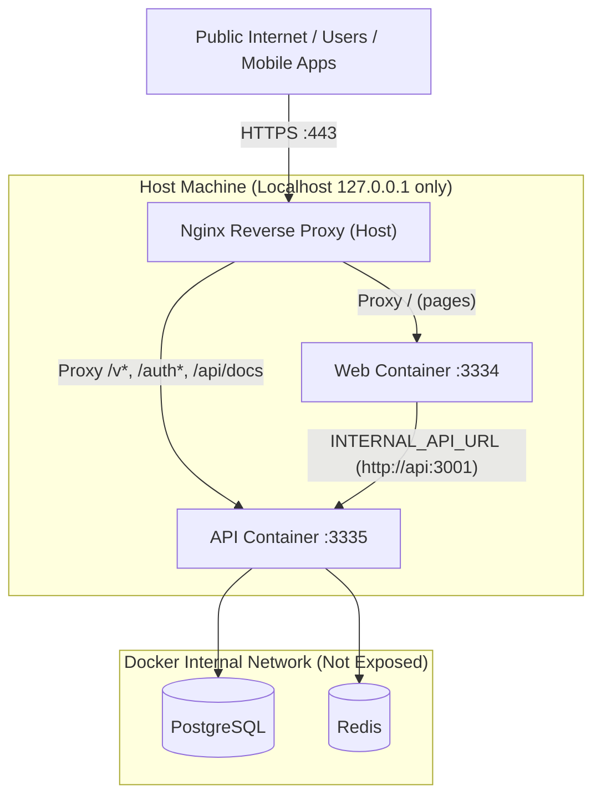

# Deployment Guide (Nginx Reverse Proxy)

This project is fully containerized with Docker Compose and designed to sit securely behind an **Nginx reverse proxy** with SSL/TLS.

**Production Domain:** [https://bloodaid.scripthorizon.tech](https://bloodaid.scripthorizon.tech)

---

## 1. Architecture Overview

### How Ports are Hidden from the Internet

In [docker-compose.yml](./docker-compose.yml):

- **Web (`3334`)** and **API (`3335`)** are bound **strictly to `127.0.0.1`** (localhost).
- They are **hidden from the public internet**. No external visitor or firewall scanner can access `http://<server-ip>:3334` or `http://<server-ip>:3335` directly.
- **PostgreSQL (`5432`)** and **Redis (`6379`)** have **no host ports** published at all. They are strictly isolated inside the `backend` Docker network.
- Inside Docker, the Next.js `web` container talks directly to the NestJS `api` container via `INTERNAL_API_URL=http://api:3001`.



---

## 2. How People Access the Application & API

External clients (web browsers, mobile apps, third-party developers, and Swagger) access everything through your single public domain **`https://bloodaid.scripthorizon.tech`**:

| Path                                                         | Destination                  | Description                           |
| ------------------------------------------------------------ | ---------------------------- | ------------------------------------- |
| `https://bloodaid.scripthorizon.tech/`                     | Next.js Frontend (`:3334`) | Main web platform UI                  |
| `https://bloodaid.scripthorizon.tech/auth/google`          | NestJS API (`:3335`)       | Initiates Google OAuth login          |
| `https://bloodaid.scripthorizon.tech/auth/google/callback` | NestJS API (`:3335`)       | Google OAuth callback handler         |
| `https://bloodaid.scripthorizon.tech/v1/...`               | NestJS API (`:3335`)       | Version 1 API endpoints               |
| `https://bloodaid.scripthorizon.tech/v2/...`               | NestJS API (`:3335`)       | Future API versions (auto-routed)     |
| `https://bloodaid.scripthorizon.tech/api/docs`             | NestJS API (`:3335`)       | Swagger API interactive documentation |

---

## 3. Configuration (`.env`)

Create a `.env` file at the root of the project:

```bash
cp .env.example .env
```

All variables are strictly required. If any variable is missing, Compose will stop and display an error.

### Key Production Settings:

```env
PROJECT_NAME="Blood Aid"
NODE_ENV=production

# Database & Redis (Internal to Docker)
POSTGRES_USER=postgres
POSTGRES_PASSWORD=your_strong_db_password
POSTGRES_DB=blood_platform
REDIS_PASSWORD=your_strong_redis_password

# API Service
PORT=3001
API_PORT=3335
MIGRATIONS_RUN=true
JWT_ACCESS_SECRET=your_32char_hex_secret
JWT_ACCESS_EXPIRES_IN=30d
JWT_REFRESH_SECRET=your_32char_hex_secret
JWT_REFRESH_EXPIRES_IN=30d
CORS_ORIGIN=https://bloodaid.scripthorizon.tech

# Google OAuth (Unversioned callback)
GOOGLE_CLIENT_ID=631641086229-uhss2d2elmmouho1tsjps9ec0l1jprtp.apps.googleusercontent.com
GOOGLE_CLIENT_SECRET=your_google_client_secret
GOOGLE_CALLBACK_URL=https://bloodaid.scripthorizon.tech/auth/google/callback

# Web Push (VAPID)
VAPID_PUBLIC_KEY=your_vapid_public_key
VAPID_PRIVATE_KEY=your_vapid_private_key

# Frontend Web
WEB_PORT=3334
NEXT_PUBLIC_API_URL=https://bloodaid.scripthorizon.tech
NEXT_PUBLIC_PROJECT_NAME="Blood Aid"
NEXT_PUBLIC_VAPID_PUBLIC_KEY=your_vapid_public_key
```

> [!IMPORTANT]
> **Customizing Host Ports (Avoiding Server Port Conflicts):**
> If ports `3000` or `3001` are already in use by other applications on your host server:
> - Change `WEB_PORT` (e.g. `WEB_PORT=3334`) and `API_PORT` (e.g. `API_PORT=3335`) in `.env`.
> - In your Nginx config, change the proxy targets to match (`127.0.0.1:3334` and `127.0.0.1:3335`).
> - **DO NOT CHANGE `PORT=3001`!** `PORT=3001` is strictly the port *inside* the isolated Docker container. Next.js connects internally to `http://api:3001`, and Docker maps `${API_PORT}` to container port `3001`. Changing `PORT` will cause connection timeouts and `502 Bad Gateway`.

---

## 4. Setup Nginx Reverse Proxy on Host

A production-ready Nginx configuration template is provided in [nginx.conf.example](./nginx.conf.example). It includes:
- Automatic HTTP &rarr; HTTPS redirect (Port 80 to 443)
- Automatic `www` &rarr; non-`www` redirect
- `sw.js` cache-busting headers for instant Web Push updates
- Next.js static asset caching

### Step 1: Create Nginx Site Configuration

Create the configuration file at `/etc/nginx/sites-available/bloodaid.scripthorizon.tech`:

```bash
sudo nano /etc/nginx/sites-available/bloodaid.scripthorizon.tech
```

Paste the following configuration:

```nginx
# 1. Redirect www to non-www (HTTP)
server {
    listen 80;
    listen [::]:80;
    server_name www.bloodaid.scripthorizon.tech;

    location / {
        return 301 http://bloodaid.scripthorizon.tech$request_uri;
    }
}

# 2. Main Server (Web on port 3334, API on port 3335)
server {
    listen 80;
    listen [::]:80;
    server_name bloodaid.scripthorizon.tech;

    client_max_body_size 20M;

    gzip on;
    gzip_proxied any;
    gzip_comp_level 5;
    gzip_types text/plain text/css application/json application/javascript text/xml application/xml application/xml+rss text/javascript image/svg+xml;

    # Service Worker (/sw.js) -> Next.js Web (port 3334, NEVER CACHE)
    location = /sw.js {
        proxy_pass http://127.0.0.1:3334;
        proxy_http_version 1.1;
        proxy_set_header Host $host;
        proxy_set_header X-Real-IP $remote_addr;
        proxy_set_header X-Forwarded-For $proxy_add_x_forwarded_for;
        proxy_set_header X-Forwarded-Proto $scheme;
        add_header Cache-Control "no-cache, no-store, must-revalidate";
        add_header Pragma "no-cache";
        expires 0;
    }

    # Next.js Static Assets -> Next.js Web (port 3334, cached)
    location /_next/static {
        proxy_pass http://127.0.0.1:3334;
        proxy_http_version 1.1;
        proxy_set_header Host $host;
        add_header Cache-Control "public, max-age=31536000, immutable";
        access_log off;
    }

    # Google OAuth & Auth endpoints -> NestJS API (port 3335)
    location /auth {
        proxy_pass http://127.0.0.1:3335;
        proxy_http_version 1.1;
        proxy_set_header Upgrade $http_upgrade;
        proxy_set_header Connection $http_connection;
        proxy_set_header Host $host;
        proxy_set_header X-Real-IP $remote_addr;
        proxy_set_header X-Forwarded-For $proxy_add_x_forwarded_for;
        proxy_set_header X-Forwarded-Proto $scheme;
        proxy_cache_bypass $http_upgrade;
    }

    # Versioned API Endpoints (/v1, /v2, etc.) -> NestJS API (port 3335)
    location ~ ^/v\d+ {
        proxy_pass http://127.0.0.1:3335;
        proxy_http_version 1.1;
        proxy_set_header Upgrade $http_upgrade;
        proxy_set_header Connection $http_connection;
        proxy_set_header Host $host;
        proxy_set_header X-Real-IP $remote_addr;
        proxy_set_header X-Forwarded-For $proxy_add_x_forwarded_for;
        proxy_set_header X-Forwarded-Proto $scheme;
        proxy_cache_bypass $http_upgrade;
    }

    # Swagger API Documentation -> NestJS API (port 3335)
    location ~ ^/api/docs {
        proxy_pass http://127.0.0.1:3335;
        proxy_http_version 1.1;
        proxy_set_header Host $host;
        proxy_set_header X-Real-IP $remote_addr;
        proxy_set_header X-Forwarded-For $proxy_add_x_forwarded_for;
        proxy_set_header X-Forwarded-Proto $scheme;
    }

    # Next.js Frontend Website -> Next.js Web (port 3334)
    location / {
        proxy_pass http://127.0.0.1:3334;
        proxy_http_version 1.1;
        proxy_set_header Upgrade $http_upgrade;
        proxy_set_header Connection $http_connection;
        proxy_set_header Host $host;
        proxy_set_header X-Real-IP $remote_addr;
        proxy_set_header X-Forwarded-For $proxy_add_x_forwarded_for;
        proxy_set_header X-Forwarded-Proto $scheme;
        proxy_cache_bypass $http_upgrade;
    }
}
```

*(If you changed `WEB_PORT` or `API_PORT` in `.env`, update the `3334` and `3335` port numbers accordingly).*

### Step 2: Enable the site

```bash
sudo ln -s /etc/nginx/sites-available/bloodaid.scripthorizon.tech /etc/nginx/sites-enabled/
```

### Step 3: Test and reload Nginx

```bash
sudo nginx -t
sudo systemctl reload nginx
```

### Step 4: Obtain Free SSL Certificate with Certbot

```bash
sudo certbot --nginx -d bloodaid.scripthorizon.tech -d www.bloodaid.scripthorizon.tech
```

*Certbot will automatically obtain certificates for both domains, configure HTTPS on port 443, and set up permanent HTTP-to-HTTPS redirects.*

---

## 5. Build and Start the Docker Stack

Ensure your `.env` file is in place, then launch the stack:

```bash
docker compose up -d --build
```

### Verify Running Containers

```bash
docker compose ps
```

Both `blood_web` and `blood_api` will be running, bound only to `127.0.0.1:3334` and `127.0.0.1:3335`.

---

## 6. Database Migrations & First Admin

### Migrations

When `MIGRATIONS_RUN=true`, database migrations and the PostGIS extension run **automatically on container startup**.

To run migrations manually if ever needed:

```bash
docker compose exec api pnpm --filter api migration:run
```

### Bootstrapping First Admin

1. Log in once via Google OAuth at `https://bloodaid.scripthorizon.tech/login`.
2. Connect to the PostgreSQL database container:
   ```bash
   docker compose exec postgres psql -U postgres -d blood_platform
   ```
3. Update user role:
   ```sql
   UPDATE users SET role = 'ADMIN' WHERE email = 'your.email@gmail.com';
   ```

---

## 7. Maintenance Commands

**View logs from all containers:**

```bash
docker compose logs -f
```

**View API logs specifically:**

```bash
docker compose logs -f api
```

**Restart a service (e.g. after code update):**

```bash
docker compose restart api
docker compose restart web
```

**Stop the stack:**

```bash
docker compose down
```
